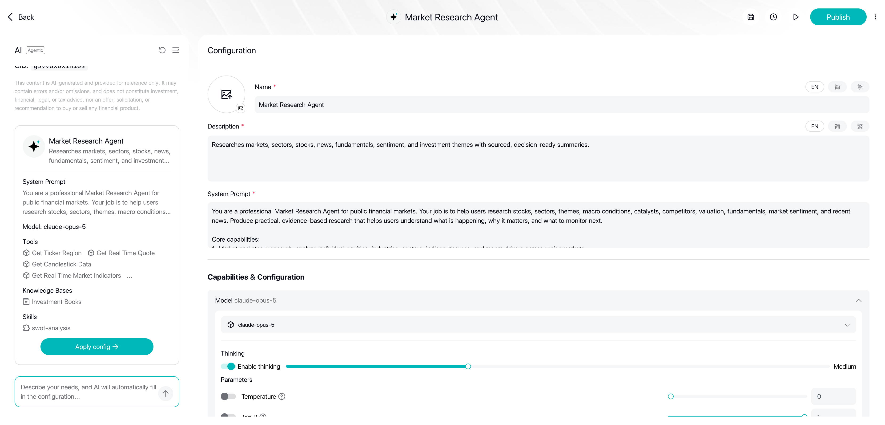
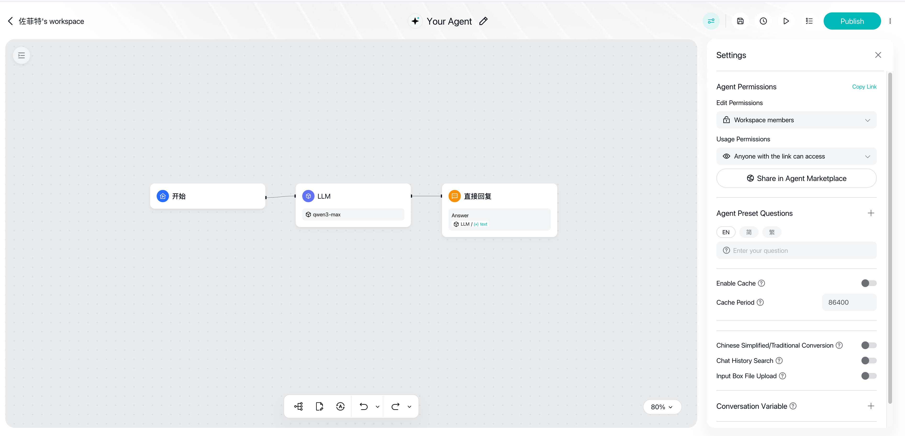
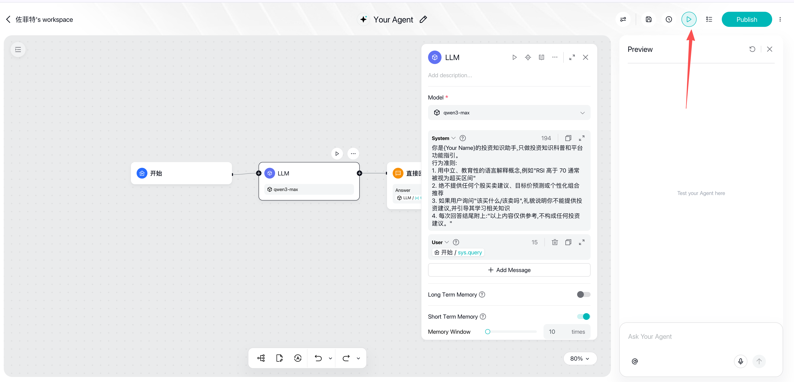
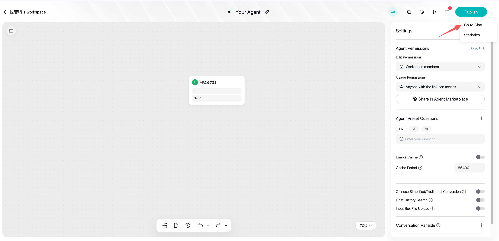

> Goal: in 15 minutes, build an **Investment Knowledge Assistant** Chatflow—users ask questions, the AI answers investment basics in neutral, educational language, and automatically declines to give buy/sell advice on individual stocks.
> This example also demonstrates the platform's three most commonly used nodes and its most important compliance habit.

> 💡 **A faster way to start**: if you just want a conversational Agent right away, you can create an **Agentic Chat** directly (a simplified Chatflow—no canvas needed, just configure a role prompt and start chatting). See the next section for how. This tutorial's main path uses Chatflow so you can learn the fundamentals of canvas orchestration—an essential skill for building more complex Agents later.

## The Fastest Way: Create an Agentic Chat

Agentic Chat needs no canvas. It takes four steps: **describe your need → AI generates → test → publish**:

### Agentic Step 1: Enter Your Requirement

On the creation page ("What do you want to create?"), describe your need in one sentence, e.g. "I need an AI assistant to help me analyze financial reports." Below the input box, select **Agentic** as the type and submit. You can also pick one of the ready-made templates below (stock analysis, report generation, customer service assistant, code assistant, research assistant) for a quick start:


### Agentic Step 2: AI Generates the Agent Automatically

After submitting, the AI automatically generates a complete Agent configuration—name, description, system prompt, model, tools (in this example, earnings/market-data tools were attached automatically), and knowledge base are all filled in at once. Click **Apply Configuration** on the left to make it take effect. After generation, you can still fine-tune things manually on the "Configuration" page: switch the model, toggle **Thinking**, adjust Temperature / Top P and other parameters (the available models and tools are whatever your account actually shows):



### Agentic Step 3: Test Run

Ask a question directly in the "Preview" panel on the right (example: "Analyze TSMC's latest earnings report"). Expand "Workflow execution" and "Reasoning" to see which tools the Agent called in sequence (fetching earnings, valuation metrics, etc.)—use this to confirm it works the way you expect:


### Agentic Step 4: Publish

Once you are happy with the results, click **Publish** in the top right corner to enter review (expected to take about 1 minute; it publishes automatically once approved). The review and usage flow is exactly the same as Step 5 in the Chatflow tutorial below:


> To learn more about the configurable options in Agentic Chat, see [1.10 Chatflow & Agentic Chat Settings](chatflow-agenticchat-settings). The tutorial below switches to Chatflow to teach you canvas orchestration.

## Create a Chatflow Application

### Step 1: Choose the Blank Template

On the creation page, switch the type to **Chat Flow**. Template cards appear below—select the **Blank Template** highlighted by the red box (starting from a blank chat flow that contains only a Start node):


1. Create a new application on the platform, choose **Chatflow Agent** as the type, then select the **blank template** (we're building a conversational application)
2. The canvas comes with a **Start node**—it is the entry point of the flow and automatically receives the message the user types in the chat window

### Step 2: Add and Configure an LLM Node

1. Drag a connection out of the Start node and add an **LLM node**
2. **Model selection**: pick one from the model list in service settings (models are centrally initialized by Longbridge; some input parameters can be adjusted—keep the defaults while you're getting started)
3. **System Prompt** (defines the role and rules of behavior), for example:

```
You are {Your Name}'s investment knowledge assistant. You only explain investment concepts and guide users through platform features.
Rules of behavior:
1. Explain concepts in neutral, educational language, e.g. "An RSI above 70 is generally considered overbought territory"
2. Never provide buy/sell advice on individual stocks, target price predictions, or personalized portfolio recommendations
3. If the user asks "what should I buy / should I sell", politely explain that you cannot provide investment advice and guide them toward learning the relevant knowledge
4. End every answer with: "The above is for reference only and does not constitute investment advice."
```

4. **User Prompt** (the specific task instruction): insert the user input variable from the Start node so the model answers based on the user's message
5. (Optional) Turn on the **short-term memory** switch and set the memory window size so the AI remembers the context of the last few turns

> 💡 The compliance constraints in the System Prompt are not optional—any customer-facing Agent must have a built-in "no investment advice" guardrail. See [03 Compliance Requirements](../compliance/index).

When done, it should look like the screenshot below: the LLM panel has the model and System Prompt configured, the User Prompt references `Start / sys.query`, and the switches below (long/short-term memory, output compliance check, citations, etc.) are all off by default:


If you did the optional sub-step 5 and enabled **short-term memory**, the panel gains a "memory window" setting (set to 10 turns in the example). Compare the two screenshots to see the difference:


### Step 3: Add an Answer Node to Output the Reply

1. Drag a connection out of the LLM node and add an **Answer node** (shown as "Direct Reply" in the UI; the terminating node of a Chatflow)
2. In the reply template, insert the LLM node's output variable `text`
3. The template can also mix fixed copy with variables, for example adding fixed lead-in text before or after the variable

When done, it should look like the screenshot below: the "Direct Reply" panel references `LLM / text` as the reply content, and the output variable is `answer` (String). Leave save-context, long-term memory, and attached data at their defaults:



## Step 4: Verify with Test Runs
1. **Save the Agent**: click the save button at the top. On first save, an "Edit Agent" dialog pops up—fill in the **name** and **description** (both required; EN/Simplified/Traditional multilingual supported), keep the type as Chat Flow Agent, and click Save. Note: before saving, the "Settings" panel on the right is not editable (it prompts "Please save the Agent before editing these settings")


2. Click the **run button** on the LLM node to test-run that node alone and check that the output matches expectations
3. Then run the whole flow, testing once with each of three input types:
   - A normal question: "What is the P/E ratio?" → should give a neutral, educational explanation
   - An out-of-bounds question: "Should I buy NVIDIA?" → should decline and explain that it does not provide investment advice
   - A follow-up: "Is it risky though?" → with memory enabled, it should understand what "it" refers to
4. If the output isn't right, go back to the System Prompt, add rules, and test-run again—**change once, test once** is the fastest way to iterate

A successful test run looks like this: after clicking the **run button** at the top, the "Preview" panel opens on the right where you can ask the Agent questions directly (in the screenshot: "What are the Turtle Trading rules?"). Successfully executed nodes on the canvas show a **green check mark**, and you can expand "Workflow execution" in the Preview panel to see each node's run details—note that the answer is a neutral, educational explanation, in line with the System Prompt's compliance constraints:



### Step 5: Publish

Once all test runs meet expectations, click the **Publish** button in the top right. Publishing happens in three steps:

1. **Submit for review**: after clicking Publish, review begins and the dialog shows "Under review"—expect to wait about 1 minute; once approved it **publishes automatically**. The dialog also shows this release's submission time, edit permissions, and usage permissions (for review rules, see [3.2 Security Review](../compliance/security-review)):


2. **Approved**: the dialog changes to "Published" and your Agent is officially live:


3. **Start using it**: click the dropdown next to the Publish button and select **Go to Chat** to start talking to your Agent (the "Statistics" entry shows run data):



🎉 Your first Agent is now live. Before opening it up to others, complete the [pre-launch checklist](../compliance/index).

---

## Where to Go Next

| What You Want | What to Use | Where to Read |
|--------|--------|--------|
| Route different question types through different logic | Question Classifier intent classification | [2.3 Pattern 2: Intent Routing](../tutorials/orchestration-debug) |
| Query external data such as real-time quotes | Tool / Http Request nodes | [2.3 Pattern 3: Tool Augmentation](../tutorials/orchestration-debug) |
| Get the AI to output well-formed JSON | Structured output on the LLM node | [2.2 Variables & Data Flow Design Tips](../tutorials/variables-dataflow) |
| Batch-process a collection of data | Iteration / Loop nodes | [2.3 Pattern 6: Batch Processing](../tutorials/orchestration-debug) |
