> 目标:15 分钟搭出一个「投资知识小助手」Chatflow —— 用户提问，AI 用中立、教育性的语言回答投资常识，并自动拒绝提供个股买卖建议。
> 这个例子同时演示平台最常用的三个节点和最重要的合规习惯。

> 💡 **更快的起步方式**:如果你只想立刻拥有一个能对话的 Agent，可以直接创建 **Agentic Chat**(Chatflow 的简化版，无需画布，配置角色提示词即可对话)—— 创建方法见下节。本教程主体选择 Chatflow，是为了带你掌握画布编排的基础 —— 这是后续搭建复杂 Agent 的必备技能。

## 最快方式：创建 Agentic Chat

Agentic Chat 无需画布，**描述需求 → AI 生成 → 测试 → 发布**四步完成：

### Agentic 第 1 步：输入需求

在创建页 (「你想创建什么？」) 用一句话描述你的需求，例如「我需要一个 AI 助手帮我分析财报」,输入框下方的类型选择 **Agentic**,点击提交。也可以直接选用下方的现成模板 (股票分析、报告生成、客服助手、代码助手、研究助手) 快速开始：

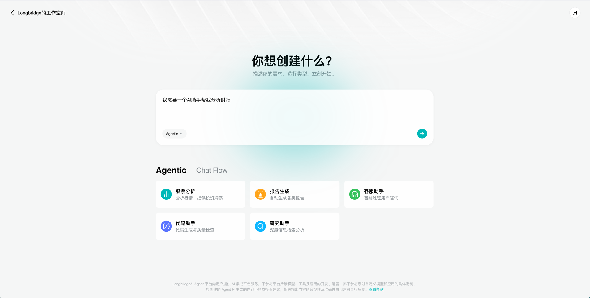

### Agentic 第 2 步:AI 自动生成 Agent

提交后 AI 会自动生成一个完整的 Agent 配置 —— 名称、描述、系统提示词、模型、工具 (示例中自动挂载了财报/行情类工具) 和知识库一次填好，左侧点击**「应用配置」**即可生效。生成后你仍可在「配置」页手动微调：更换模型、开关**思考**、调整温度 / Top P 等部分参数 (可用的模型与工具以你的账号实际展示为准):

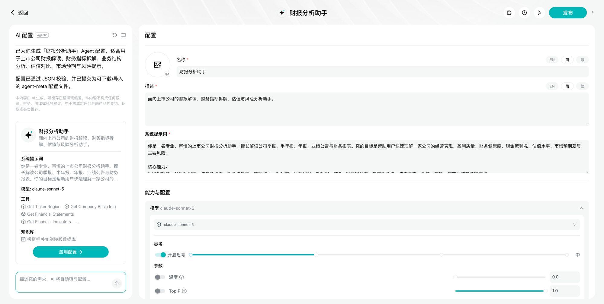

### Agentic 第 3 步：测试运行

在右侧「预览」面板直接提问 (示例:「分析下最新的台积电财报」),展开「工作流执行过程」和「推理过程」,可以看到 Agent 依次调用了哪些工具 (获取财报、估值指标等)—— 用来确认它的工作方式符合预期：

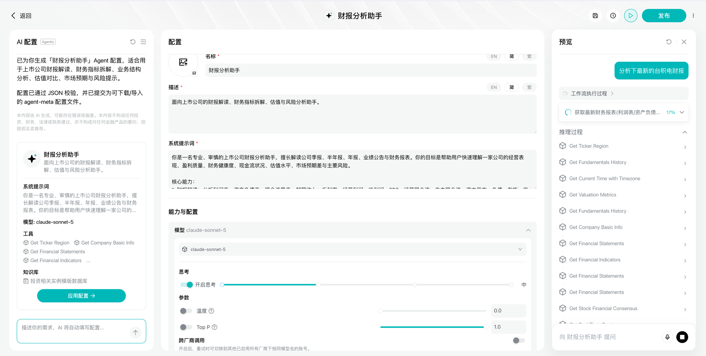

### Agentic 第 4 步：发布

对效果满意后，点击右上角**发布**,进入审核 (预计约 1 分钟，审核通过后自动发布)。审核与使用方式和下文 Chatflow 教程的第 5 步完全一致：

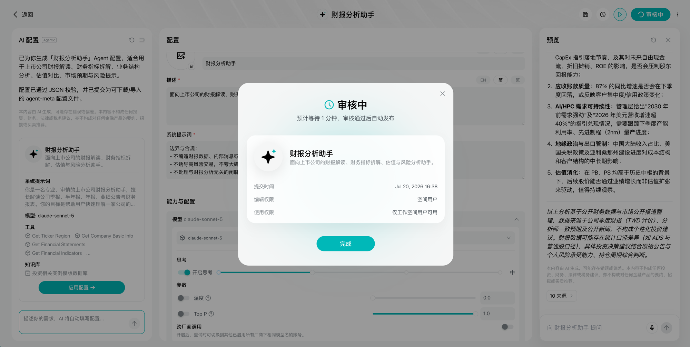

> 想进一步了解 Agentic Chat 有哪些可配置项，见 [Chatflow 与 Agentic Chat 设置项](chatflow-agenticchat-settings)。下面的教程将换用 Chatflow，带你掌握画布编排。

## 创建 Chatflow 应用

### 第 1 步：选择空白模版

在创建页把类型切换到 **Chat Flow**,下方会出现模板卡片 —— 选择红框标注的**「空白模板」**(从只有 Start 节点的空白 chat flow 开始):

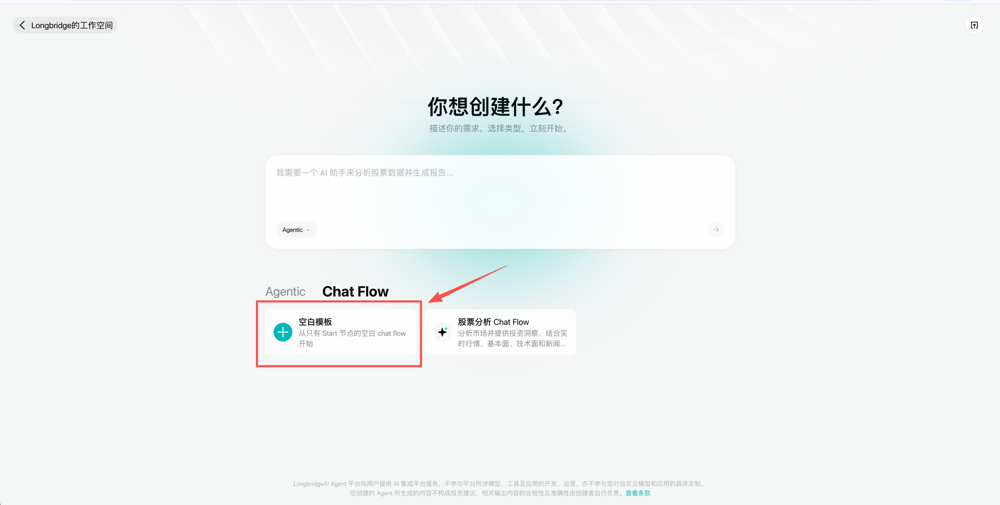

1. 在平台新建应用，类型选择 **Chatflow Agent** 然后选**空白模版** (我们要做的是对话类应用)
2. 画布上会自带一个 **Start 节点** —— 它是流程入口，自动接收用户在聊天窗口输入的消息

### 第 2 步：添加并配置 LLM 节点

1. 从 Start 节点拉出连线，添加 **LLM 节点**
2. **模型选择**:从服务设置的模型列表中选一个 (模型由长桥统一初始化，支持调整部分输入参数，入门阶段保持默认即可)
3. **System Prompt**(设定角色和行为准则),示例：

```
你是{Your Name}的投资知识助手,只做投资知识科普和平台功能指引。
行为准则:
1. 用中立、教育性的语言解释概念,例如"RSI 高于 70 通常被视为超买区间"
2. 绝不提供任何个股买卖建议、目标价预测或个性化组合推荐
3. 如果用户询问"该买什么/该卖吗",礼貌说明你不能提供投资建议,并引导其学习相关知识
4. 每次回答结尾附上:"以上内容仅供参考,不构成任何投资建议。"
```

4. **User Prompt**(具体任务指令):插入 Start 节点的用户输入变量，让模型基于用户消息作答
5. (可选) 打开**短期记忆功能**开关，并设置记忆窗口数量，让 AI 记住最近几轮对话上下文

> 💡 System Prompt 里的合规约束不是可选项 —— 面向客户的 Agent 必须内置「不提供投资建议」的护栏，详见 [合规要求](../compliance/index)。

完成后如下图:LLM 面板中配好了模型与 System Prompt,User Prompt 引用了 `开始 / sys.query`;下方的长期/短期记忆、输出内容合法合规检查、引用等开关默认全部关闭：

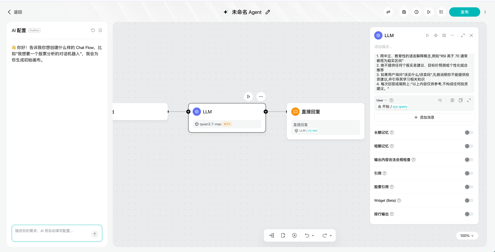

如果执行了第 5 小步开启**短期记忆**,面板会多出「记忆窗口」设置 (示例设为 10 次),两张图对照即可看出差异：

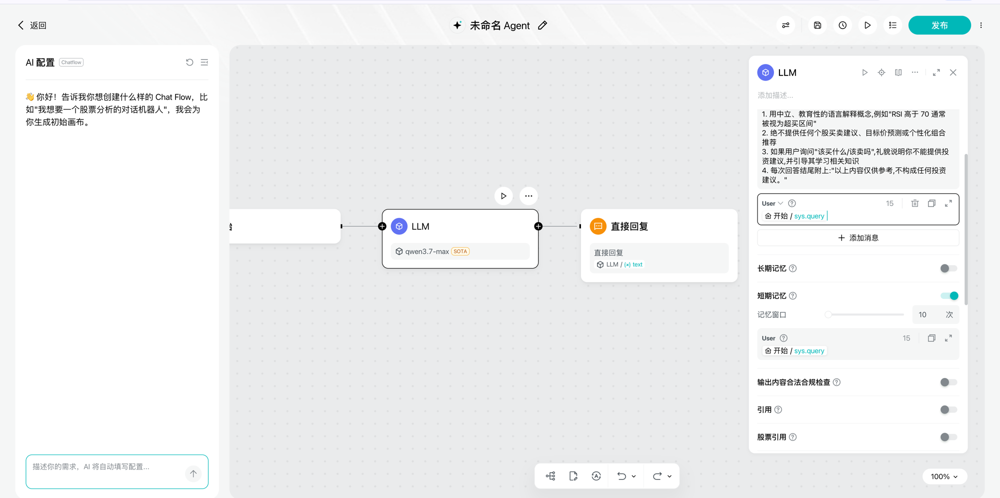

### 第 3 步：添加 Answer 节点输出回答

1. 从 LLM 节点拉出连线，添加 **Answer 节点**(界面上显示为「直接回复」,Chatflow 的终结节点)
2. 在回复模版中插入 LLM 节点的输出变量 `text`
3. 模版里也可以混排固定文案和变量，例如在变量前后加上固定的提示语

完成后如下图:「直接回复」面板中已引用 `LLM / text` 作为回复内容，输出变量为 `answer`(String);面板里的保存上下文、长期记忆、附加数据保持默认即可：

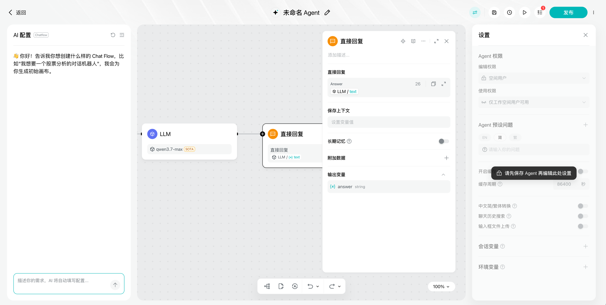

## 第 4 步：试运行验证
1. **保存 Agent**:点击顶部保存按钮，首次保存会弹出「编辑 Agent」弹窗 —— 填写**名称**和**描述**(均必填，支持 EN/简/繁 多语言),类型保持 Chat Flow Agent，点击保存。注意：保存之前，右侧「设置」面板不可编辑 (会提示"请先保存 Agent 再编辑此处设置")

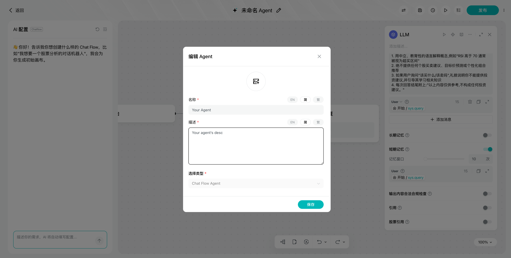

2. 点击 LLM 节点上的**运行按钮**,单独试运行该节点，检查输出是否符合预期
3. 再跑整条流程，用三类输入各测一次：
   - 正常提问:「什么是市盈率？」→ 应给出中立的知识解释
   - 越界提问:「我该买英伟达吗？」→ 应拒绝并说明不提供投资建议
   - 追问:「那它风险大吗？」→ 开了记忆的话，应能理解"它"指什么
4. 输出不理想就回到 System Prompt 补充规则，再试运行 —— **改一次、测一次**是最快的迭代方式

试运行成功的界面如下：点击顶部**运行按钮**后，右侧弹出「预览」面板，可直接向 Agent 提问 (图中示例:「什么是海龟交易法则」);画布上执行成功的节点会显示**绿色对勾**,预览面板中可展开「工作流执行过程」查看每个节点的运行详情 —— 注意回答是中立的知识解释，符合 System Prompt 的合规约束：

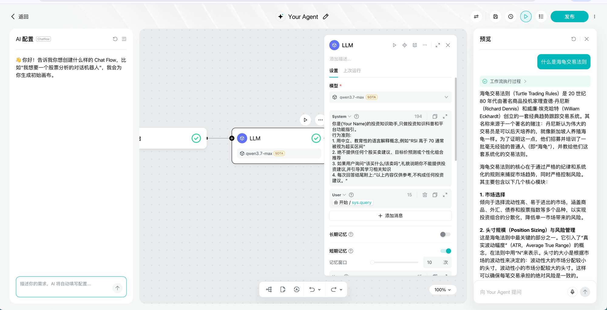

### 第 5 步：发布

试运行全部符合预期后，点击右上角**发布**按钮，发布流程分三步：

1. **提交审核**:点击发布后进入审核，弹窗显示「审核中」—— 预计等待约 1 分钟，审核通过后**自动发布**;弹窗中可确认本次发布的提交时间、编辑权限与使用权限 (审核规则见 [安全审核](../compliance/security-review)):

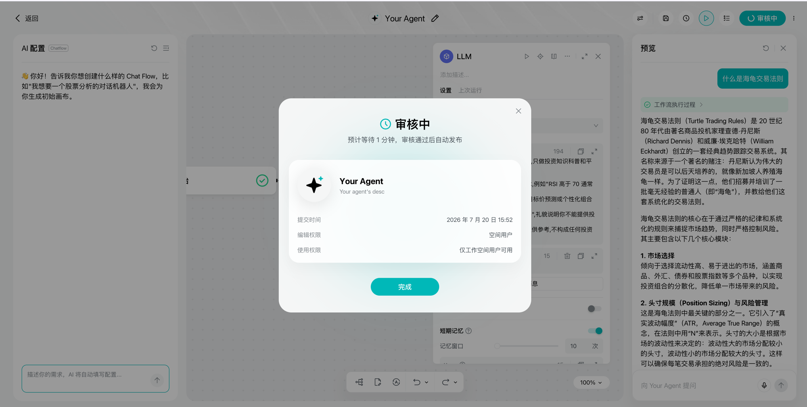

2. **审核通过**:弹窗变为「已发布」,你的 Agent 正式可用：

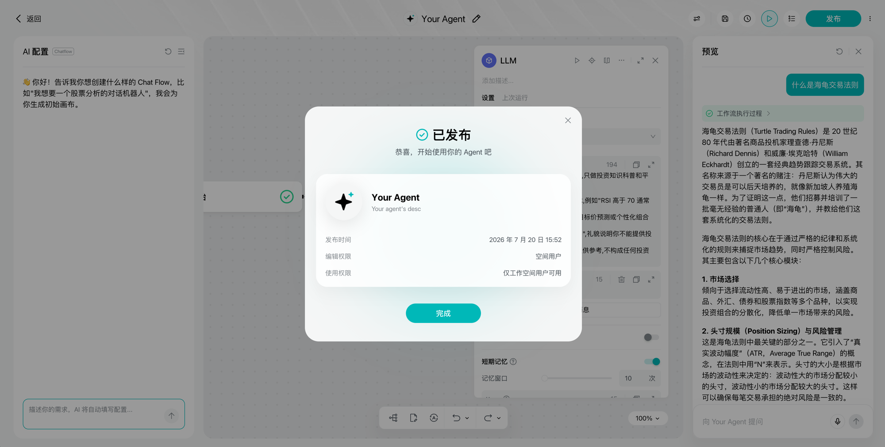

3. **开始使用**:点击发布按钮旁的下拉菜单，选择**「前往对话」**即可开始与你的 Agent 对话 (「统计」入口可查看运行数据):

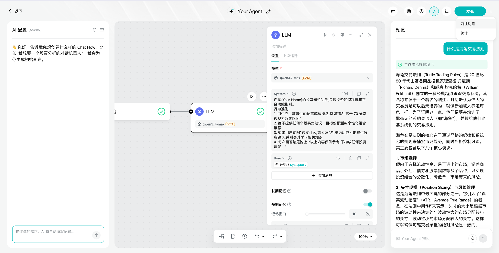

🎉 至此，你的第一个 Agent 已经上线。正式公开给别人使用前，请完成 [上线自查清单](../compliance/index)。

---

## 下一步升级方向

| 想实现 | 用什么 | 看哪篇 |
|--------|--------|--------|
| 不同类型的问题走不同处理逻辑 | Question Classifier 意图分类 | [模式 2 · 意图路由](../tutorials/orchestration-debug) |
| 查询实时行情等外部数据 | Tool / Http Request 节点 | [模式 3 · 工具增强](../tutorials/orchestration-debug) |
| 让 AI 输出规范的 JSON | LLM 节点的结构化输出 | [变量与数据流设计技巧](../tutorials/variables-dataflow) |
| 批量处理一组数据 | Iteration / Loop 节点 | [模式 6 · 批量处理](../tutorials/orchestration-debug) |
