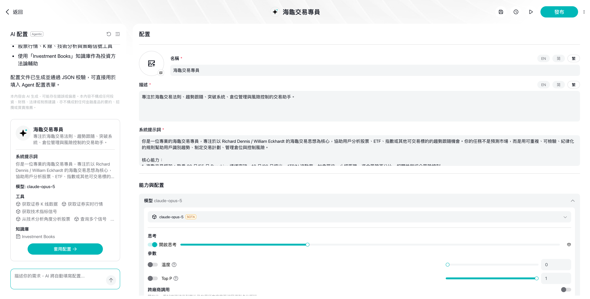
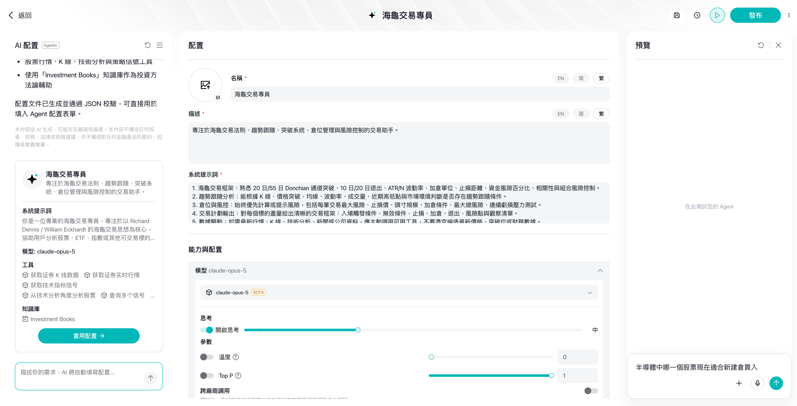
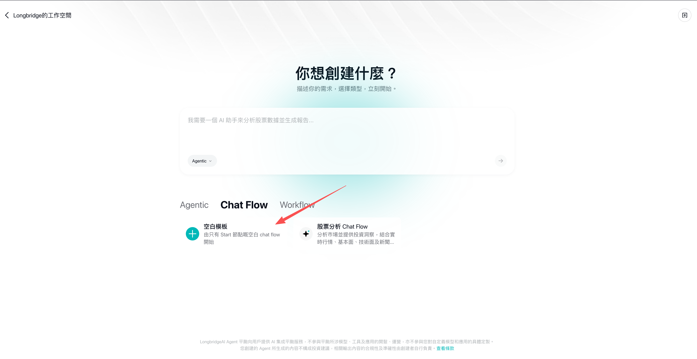
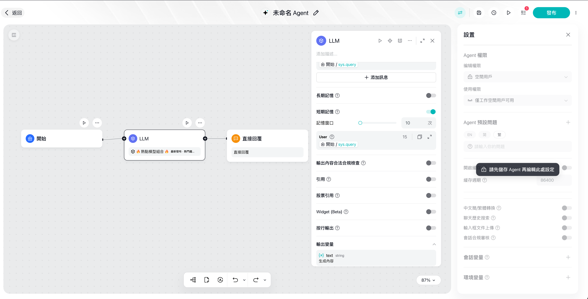
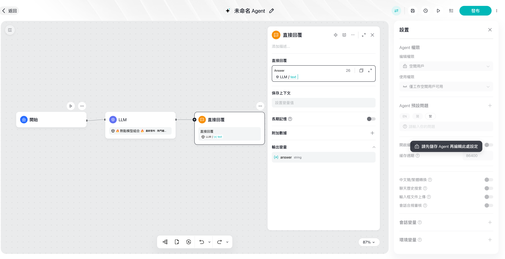
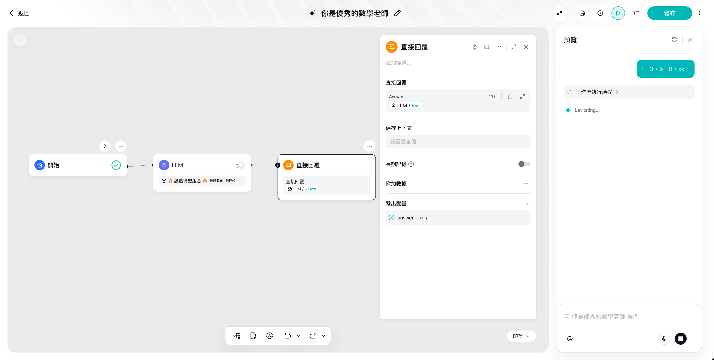
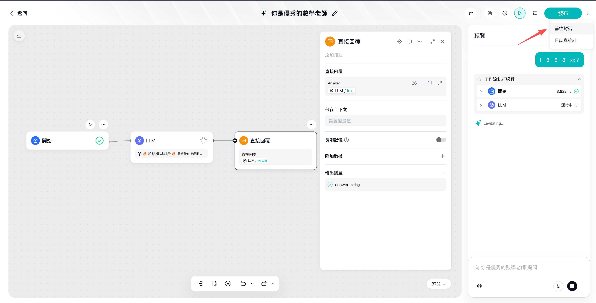

> 目標:15 分鐘搭出一個「投資知識小助手」Chatflow —— 使用者提問，AI 用中立、教育性的語言回答投資常識，並自動拒絕提供個股買賣建議。
> 這個例子同時演示平臺最常用的三個節點和最重要的合規習慣。

> 💡 **更快的起步方式**:如果你只想立刻擁有一個能對話的 Agent，可以直接建立 **Agentic Chat**(Chatflow 的簡化版，無需畫布，配置角色提示詞即可對話)—— 建立方法見下節。本教程主體選擇 Chatflow，是為了帶你掌握畫布編排的基礎 —— 這是後續搭建複雜 Agent 的必備技能。

## 最快方式：建立 Agentic Chat

Agentic Chat 無需畫布，**描述需求 → AI 生成 → 測試 → 釋出**四步完成：

### Agentic 第 1 步：輸入需求

在建立頁 (「你想建立什麼？」) 用一句話描述你的需求，例如「我需要一個 AI 助手幫我分析財報」,輸入框下方的型別選擇 **Agentic**,點選提交。也可以直接選用下方的現成模板 (股票分析、報告生成、客服助手、程式碼助手、研究助手) 快速開始：


### Agentic 第 2 步:AI 自動生成 Agent

提交後 AI 會自動生成一個完整的 Agent 配置 —— 名稱、描述、系統提示詞、模型、工具 (示例中自動掛載了財報/行情類工具) 和知識庫一次填好，左側點選**「應用配置」**即可生效。生成後你仍可在「配置」頁手動微調：更換模型、開關**思考**、調整溫度 / Top P 等部分引數 (可用的模型與工具以你的賬號實際展示為準):



### Agentic 第 3 步：測試執行

在右側「預覽」面板直接提問 (示例:「分析下最新的台積電財報」),展開「工作流執行過程」和「推理過程」,可以看到 Agent 依次呼叫了哪些工具 (獲取財報、估值指標等)—— 用來確認它的工作方式符合預期：



### Agentic 第 4 步：釋出

對效果滿意後，點選右上角**釋出**,進入稽核 (預計約 1 分鐘，稽核通過後自動釋出)。稽核與使用方式和下文 Chatflow 教程的第 5 步完全一致：


> 想進一步瞭解 Agentic Chat 有哪些可配置項，見 [Chatflow 與 Agentic Chat 設定項](chatflow-agenticchat-settings)。下面的教程將換用 Chatflow，帶你掌握畫布編排。

## 建立 Chatflow 應用

### 第 1 步：選擇空白模版

在建立頁把型別切換到 **Chat Flow**,下方會出現模板卡片 —— 選擇紅框標註的**「空白模板」**(從只有 Start 節點的空白 chat flow 開始):



1. 在平臺新建應用，型別選擇 **Chatflow Agent** 然後選**空白模版** (我們要做的是對話類應用)
2. 畫布上會自帶一個 **Start 節點** —— 它是流程入口，自動接收使用者在聊天視窗輸入的訊息

### 第 2 步：新增並配置 LLM 節點

1. 從 Start 節點拉出連線，新增 **LLM 節點**
2. **模型選擇**:從服務設定的模型列表中選一個 (模型由長橋統一初始化，支援調整部分輸入引數，入門階段保持預設即可)
3. **System Prompt**(設定角色和行為準則),示例：

```
你是{Your Name}的投資知識助手,只做投資知識科普和平臺功能指引。
行為準則:
1. 用中立、教育性的語言解釋概念,例如"RSI 高於 70 通常被視為超買區間"
2. 絕不提供任何個股買賣建議、目標價預測或個性化組合推薦
3. 如果使用者詢問"該買什麼/該賣嗎",禮貌說明你不能提供投資建議,並引導其學習相關知識
4. 每次回答結尾附上:"以上內容僅供參考,不構成任何投資建議。"
```

4. **User Prompt**(具體任務指令):插入 Start 節點的使用者輸入變數，讓模型基於使用者訊息作答
5. (可選) 開啟**短期記憶功能**開關，並設定記憶視窗數量，讓 AI 記住最近幾輪對話上下文

> 💡 System Prompt 裡的合規約束不是可選項 —— 面向客戶的 Agent 必須內建「不提供投資建議」的護欄，詳見 [合規要求](../compliance/index)。

完成後如下圖:LLM 面板中配好了模型與 System Prompt,User Prompt 引用了 `開始 / sys.query`;下方的長期/短期記憶、輸出內容合法合規檢查、引用等開關預設全部關閉：


如果執行了第 5 小步開啟**短期記憶**,面板會多出「記憶視窗」設定 (示例設為 10 次),兩張圖對照即可看出差異：



### 第 3 步：新增 Answer 節點輸出回答

1. 從 LLM 節點拉出連線，新增 **Answer 節點**(介面上顯示為「直接回復」,Chatflow 的終結節點)
2. 在回覆模版中插入 LLM 節點的輸出變數 `text`
3. 模版裡也可以混排固定文案和變數，例如在變數前後加上固定的提示語

完成後如下圖:「直接回復」面板中已引用 `LLM / text` 作為回覆內容，輸出變數為 `answer`(String);面板裡的儲存上下文、長期記憶、附加資料保持預設即可：



## 第 4 步：試執行驗證
1. **儲存 Agent**:點選頂部儲存按鈕，首次儲存會彈出「編輯 Agent」彈窗 —— 填寫**名稱**和**描述**(均必填，支援 EN/簡/繁 多語言),型別保持 Chat Flow Agent，點選儲存。注意：儲存之前，右側「設定」面板不可編輯 (會提示"請先儲存 Agent 再編輯此處設定")


2. 點選 LLM 節點上的**執行按鈕**,單獨試執行該節點，檢查輸出是否符合預期
3. 再跑整條流程，用三類輸入各測一次：
   - 正常提問:「什麼是市盈率？」→ 應給出中立的知識解釋
   - 越界提問:「我該買輝達嗎？」→ 應拒絕並說明不提供投資建議
   - 追問:「那它風險大嗎？」→ 開了記憶的話，應能理解"它"指什麼
4. 輸出不理想就回到 System Prompt 補充規則，再試執行 —— **改一次、測一次**是最快的迭代方式

試執行成功的介面如下：點選頂部**執行按鈕**後，右側彈出「預覽」面板，可直接向 Agent 提問 (圖中示例:「什麼是海龜交易法則」);畫布上執行成功的節點會顯示**綠色對勾**,預覽面板中可展開「工作流執行過程」檢視每個節點的執行詳情 —— 注意回答是中立的知識解釋，符合 System Prompt 的合規約束：



### 第 5 步：釋出

試執行全部符合預期後，點選右上角**釋出**按鈕，釋出流程分三步：

1. **提交稽核**:點擊發布後進入稽核，彈窗顯示「稽核中」—— 預計等待約 1 分鐘，稽核通過後**自動釋出**;彈窗中可確認本次釋出的提交時間、編輯許可權與使用許可權 (稽核規則見 [安全稽核](../compliance/security-review)):


2. **稽核通過**:彈窗變為「已釋出」,你的 Agent 正式可用：


3. **開始使用**:點擊發布按鈕旁的下拉選單，選擇**「前往對話」**即可開始與你的 Agent 對話 (「統計」入口可檢視執行資料):



🎉 至此，你的第一個 Agent 已經上線。正式公開給別人使用前，請完成 [上線自查清單](../compliance/index)。

---

## 下一步升級方向

| 想實現 | 用什麼 | 看哪篇 |
|--------|--------|--------|
| 不同型別的問題走不同處理邏輯 | Question Classifier 意圖分類 | [模式 2 · 意圖路由](../tutorials/orchestration-debug) |
| 查詢即時行情等外部資料 | Tool / Http Request 節點 | [模式 3 · 工具增強](../tutorials/orchestration-debug) |
| 讓 AI 輸出規範的 JSON | LLM 節點的結構化輸出 | [變數與資料流設計技巧](../tutorials/variables-dataflow) |
| 批次處理一組資料 | Iteration / Loop 節點 | [模式 6 · 批次處理](../tutorials/orchestration-debug) |
